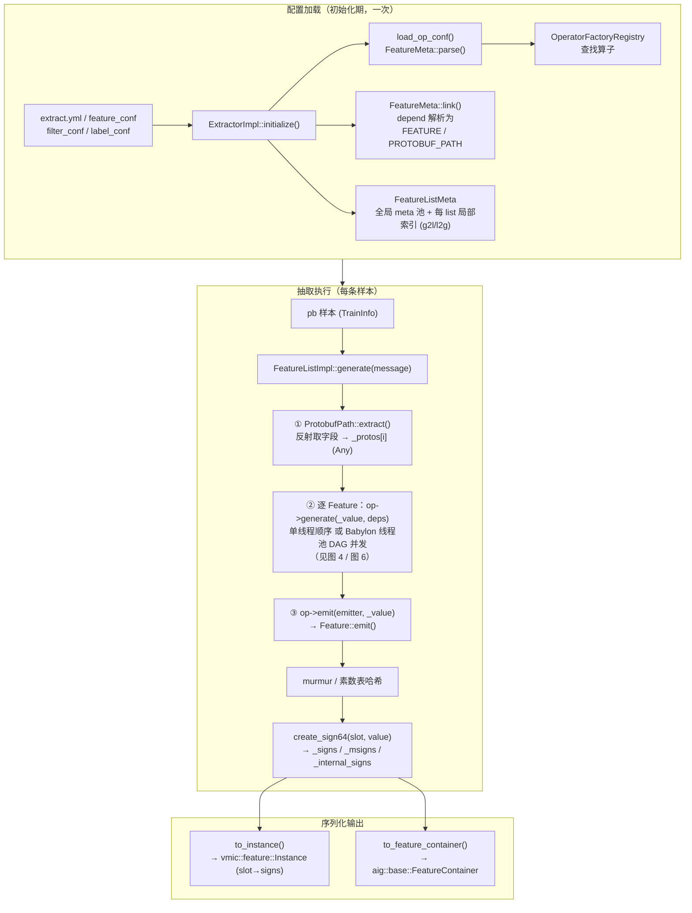
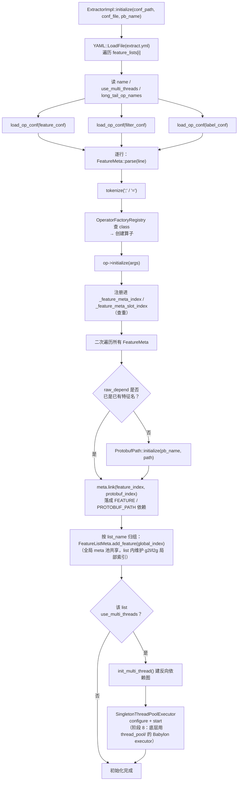
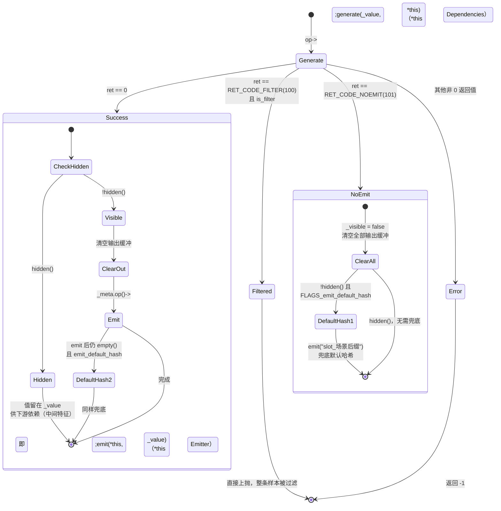
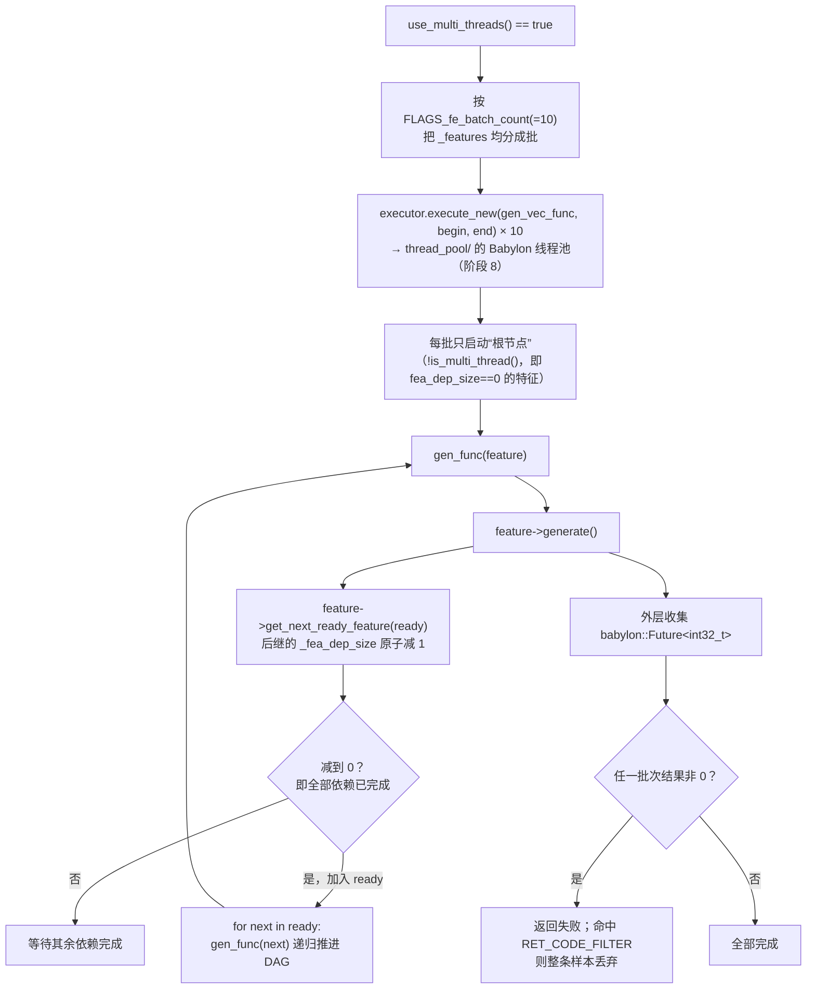
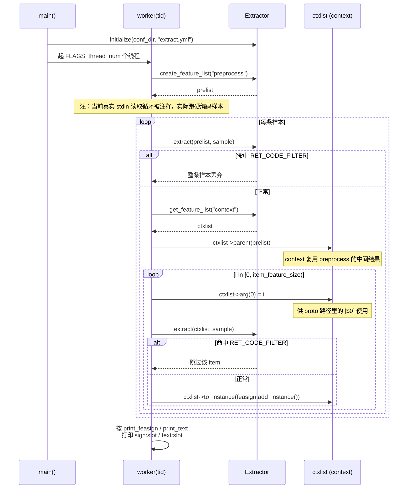
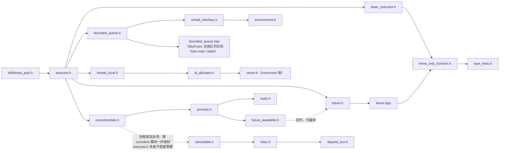

## Table of contents

**C++ 机器学习特征抽取框架**（命名空间 `vivo::iai::fef`）。它做的事情一句话概括：

> 接收一条 protobuf 样本消息（如 `vmic.feature.TrainInfo`），按配置文件声明的特征列表，用 protobuf 反射取出字段，跑一遍用户注册的算子（Operator）DAG，把产出值经 MurmurHash3 哈希成**按 slot 分组的 64 位特征签名（feature sign）**，序列化给训练/在线打分使用。

即"配置驱动的特征工程执行引擎"：新增/修改特征只改配置文件和算子，不动框架代码。

> 面向对象：需要理解、维护或移植本仓库的 C++ 工程师。
> 完整读完本文档约 **14–16 小时**；速览版（跳过阶段 5 哈希实现细节 + 阶段 8 三方库细节）约 **9 小时**。
> 所有文件引用均带 `路径:行号`，行数用于估算阅读量。行号已对照当前仓库重新核实。
> 本文档记录的"坑位"分两类：**🔴 未解决** 需要动手修复才能正确；**✅ 已修复** 是本轮排查中已经改正的问题，保留记录供追溯。

## 目录结构

```
fef/                  框架主体（命名空间 vivo::iai::fef）
├── base/             基础类型设施（Any 类型擦除、range_vector 等，命名空间 vivo::aig::base）
├── hash/              MurmurHash3 三套变体（plain / cpd / search）
├── test/              gtest 测试 + 示例算子 + 示例配置
├── test_out/          test/conf/ 的副本
└── worker/            standalone CLI，跑一个 Extractor 处理输入样本
thread_pool/           vendoring 的百度开源 Babylon 并发库（ConcurrentBoundedQueue / ThreadPoolExecutor / Future / 协程）
```

---

## 一、项目总览：这是什么

### 图 1 · 总体架构与数据流



### 仓库现状

**本仓库不能独立编译。** 它是从内部 **Blade monorepo 摘出的局部快照**：

- BUILD 文件是 Blade 语法（非 Bazel），依赖 `//thirdparty/gtest:gtest` 等 monorepo 目标；`fef/test/proto/BUILD` 的 `proto_path='thirdparty/fef/fef/test/proto'` 说明仓库原本位于 monorepo 的 `thirdparty/fef/` 下。
- 仍缺失的外部依赖：`feasign.pb.h`（定义 `vmic::feature::*`）、`com_log.h`、butil/bvar（brpc）、boost、glog、gflags、yaml-cpp、protobuf、**Google Abseil**（`thread_pool/` 新引入）。
- `fef/thread_pool.h` 依赖的 `executor.h` 现已补齐：仓库新增了 `thread_pool/` 目录，从百度开源 Babylon 库官方仓库取材，vendoring 了 `ConcurrentBoundedQueue`/`ThreadPoolExecutor`/`Future`/协程等完整依赖闭环（详见阶段 8）。
- `fef/feature.h` 等多个文件此前是转写残缺/含笔误的快照，已对照原始截图逐项核实并修复（详见"已修复问题记录"）；目前 `fef/` 下的核心文件已不再有"文件本身残缺"的问题，剩下的都是原版就带有的逻辑缺陷，或本机验证条件受限的问题。

**阅读方法**：静态读代码 + 把 `fef/test/` 下的 gtest 当"可执行文档"读；本机没有 gflags/glog/protobuf/Abseil，无法做真实编译，所有验证止步于 `clang++ -fsyntax-only` 语法检查；中文注释是一手信息，值得逐条看。

---

## 二、分阶段阅读路线

### 阶段 0 · 背景与配置直觉（约 0.5h）

**读什么（按序）**：

| 文件 | 行数 | 说明 |
|---|---|---|
| `fef/test/conf/extract.yml` | 7 | 顶层配置：feature_lists 声明 |
| `fef/test/conf/context_feature_list.conf` | 5 | 特征 conf DSL 示例 |
| `fef/test/BUILD`、`fef/base/BUILD`、`fef/hash/BUILD`、`fef/test/proto/BUILD`、`thread_pool/BUILD` | 各 <15 | Blade 构建声明 |

**核心代码片段 · conf DSL 一行**（`fef/test/conf/context_feature_list.conf:2`）：

```
name=test2;class=S_uint64tostring;slot=999;depend=response.item_feature[$0].item_id
```

逐字段解释：

- `name=test2` — 特征名，全局唯一。前缀有魔法：`.name` 表示 hidden（中间特征，不输出）；`Mname` 表示 repeate（多 slot 输出，slot 字段写成逗号分隔列表进 `_mslot`）。
- `class=S_uint64tostring` — 算子类名，去 `OperatorFactoryRegistry` 查（由 `REGISTER_OPERATOR` 静态注册）。命名约定：`S_` 单值算子、`M_` 多值/向量算子。
- `slot=999` — 输出槽位；`slot<0` 也视为 hidden。
- `depend=response.item_feature[$0].item_id` — 依赖项。先按特征名找，找不到就当 protobuf 路径解析；`[$0]` 是运行时下标（来自 `FeatureList::arg(0)`），`[*]` 取全部元素，`[N]` 取固定下标。

**本阶段要回答**：框架输入/输出各是什么？一条 conf 行如何变成一个特征？

---

### 阶段 1 · 基础类型设施 `fef/base/`（约 2h）

⚠️ 注意：`base/` 下代码在**另一个命名空间 `vivo::aig::base`**（不是 `vivo::iai::fef`），是从别的内部库搬来的通用件。

**读什么（按序）**：

| 文件 | 行数 | 重点 |
|---|---|---|
| `fef/base/helper.h` + `helper.hpp` | 294+129 | `TypeId<T>`/`Id`：无 RTTI 的静态类型标识（`__PRETTY_FUNCTION__` 生成名字、地址比较相等），Any 的地基 |
| `fef/base/any.h` + `any.hpp` | 197+301 | **Any 类型擦除**，全框架数据传递的载体 |
| `fef/index_sequence.h` | 33 | C++11 手写 `index_sequence`，供算子变参模板展开（注意这个在 `vivo::iai::fef`） |
| `fef/base/flat_range_vector.hpp` | 87 | 单块连续存储 + 命名 range 的容器（输出用，**指针式**错误处理，见下方对比） |
| `fef/base/range_vector.hpp` | 56 | 老版非扁平实现（**引用式**错误处理，🔴 见坑位表 #1） |
| `fef/base/feature_container.hpp` | 35 | `FeatureContainer`：`hashs`/`texts`/`embs`/`internal_hashs`（flat 版）+ `hashs_r`/`texts_r`/`embs_r`（legacy range 版）双套输出聚合体 |
| `fef/base/string_view.h/.hpp` | 96+309 | C++11/14 的 `std::string_view` polyfill，略读 |

**Any 的关键设计**（`any.h`）：

- 既能**存值**（PRIMITIVE/INSTANCE），也能**存引用**（`ref()`/`cref()`，不持有生命周期）——proto 反射取 string/message 时靠引用避免拷贝。
- `get<T>()`/`cget<T>()` 类型不匹配返回 nullptr（对 const 引用调非 const `get` 也返回 nullptr）；`to()` 做整数宽度转换。
- 类型信息 + 持有方式打包进一个 64 位 `Meta` tagged union。

**🔴 坑位警示（未解决）**：`range_vector.hpp:20,23,32,35` 的 `add_range`/`get_range` 错误分支执行 `static std::vector<T>* nullPtr = NULL; ... return static_cast<std::vector<T>&>(*nullPtr);`——伪造一个"指向空指针的引用"返回给调用方，一旦命中就是未定义行为（典型表现是随机崩溃或读到垃圾内存）。已用原始截图逐字节核实，**这是原版自带的设计缺陷**，不是转写引入的。同目录的 `flat_range_vector.hpp:44-51` 是姊妹类，处理同样的错误场景时用的是**指针式**（`range* add_range(...)`，失败 `return nullptr;`）——这是天然的修复参照物：把 `range_vector` 的两个方法也改成返回 `std::vector<T>*`，配合 `fef/feature.h:563,566,592,595,631` 5 处调用点从 `auto&`/直接赋值改成 `auto*`/`*ptr = ...`。**尚未修复**（一次修复尝试因工具调用失败被回退，仓库目前是原始状态）。

**本阶段要回答**：为什么依赖传递全用 Any？Any 如何同时支持存值与存引用？`range_vector` 和 `flat_range_vector` 的错误处理方式为什么不一致，应该以哪个为准？

---

### 阶段 2 · 配置解析与元数据（约 2h）

**读什么（按序）**：

| 文件 | 行数 | 重点 |
|---|---|---|
| `fef/common.h` | 101 | `tokenize`/`str_trim`/`strprintf` 等字符串工具（conf 解析、`feature.cc` 的文本调试输出全靠它） |
| `fef/feature.h`（前半，`FeatureMeta` 部分，约 1-266 行） | 788（全文件） | 元数据字段：slot/sign_slot/mslot/hidden/repeate/is_filter/is_label/depends，以及 `op()`/`op_name()`/`hashsign_dup()`/`set_type()`/`index()` 等存取器 |
| `fef/feature.cc:21-218` | 1206（全文件） | `FeatureMeta::parse()` 与 `link()` |
| `fef/extractor.cc` | 282 | `ExtractorImpl::initialize()` / `load_op_conf()` 全流程 |

**✅ 已修复**：`FeatureMeta` 此前缺 8 个方法（`op()`、`op_name()`、`hashsign_dup()`、`set_type(int) const`、`index()`/`index(size_t)` getter/setter、`set_fea_dep_size()`、`add_next_fea_local_index()`），已按原始截图在 `fef/feature.h:171-243` 补全；`hidden()`（`:208`）此前语义缺失（漏了 `|| _is_filter || _slot < 0`），已修复为 `_hidden || _is_filter || _slot < 0`。

### 图 2 · 配置解析时序



**parse 的关键细节**（`feature.cc:21` 起）：字段是**位置相关**的（3–7 段），第 4 段起可选出现 `depend`/`arg`/`sign_slot`/`hashsign_dup`；`conf_unit=="label_conf"` 置 `_is_label`，`"filter_conf"` 置 `_is_filter`；出错走 `com_writelog(COMLOG_FATAL, ...)`（外部日志宏，不是 glog）。`link()`（`feature.cc:193` 起）要求特征只能依赖**定义在它之前**的特征（index 更小），否则报错——这保证顺序执行时依赖天然就绪。

**配套测试**：`fef/test/test_feature_meta.cc`（100 行，parse 正常/畸形输入）、`fef/test/test_extractor.cc`（52 行）、`fef/test/test_feature_list_meta.cc`（103 行）。

**本阶段要回答**：全局索引与局部索引（g2l/l2g）为什么并存？（答：所有 list 共享一个 meta 池以支持跨 list 依赖与 parent 链，每个 list 只执行自己的局部子集。）重名/重 slot 在哪里查重？

---

### 阶段 3 · Protobuf 反射取值（约 1.5h）

**读什么（按序）**：

| 文件 | 行数 | 重点 |
|---|---|---|
| `fef/proto_path.h` | 608 | 路径段模型 + 大量内联的 get/set/extract 实现 |
| `fef/proto_path.cc` | – | `initialize()`/`parse_one_segment()` 路径文法解析 |
| `fef/test/test_proto_path.cc` | 331 | **全仓库最完整的测试**，当规格说明读 |

核心概念：一条路径被切成 `ProtobufPathSegment` 序列，每段带 `RepeatedType` 四态——`NONE`（非 repeated）/`ALL`（`[*]`）/`HINT`（`[$k]`，运行时下标）/`SINGLE`（`[N]`，固定下标）。路径里出现 `ALL` 则整条路径产出向量（`_single=false`）。

**核心代码片段 · 递归抽取的四态分发**（`fef/proto_path.h:511-603` 节选，`extract_vector` 模板）：

```cpp
template<typename T>
int32_t ProtobufPath::extract_vector(::std::vector<T>& value,
    const ::google::protobuf::Message& message,
    const ::std::vector<Any>& args,
    size_t level) const {
    using ::google::protobuf::Message;
    size_t next_level = level + 1;
    const auto& segment = _segments[level];
    const auto reflection = message.GetReflection();
    switch (segment.repeat_type) {
    case ProtobufPathSegment::RepeatedType::NONE: {
        if (!reflection->HasField(message, segment.descriptor)) {
            ...                                   // 字段缺失：可选补默认值(_repeat_align)后返回
        }
        if (next_level >= _segments.size()) {
            value.push_back(segment.get<T>(message));      // 末段：取叶子值
            return 0;
        } else {
            return extract_vector(value, segment.get<const Message&>(message), args, next_level);
        }                                                  // 中间段：递归下钻子消息
    }
    ...
    case ProtobufPathSegment::RepeatedType::HINT: {        // [$k]：下标来自运行时 args
        int64_t index;
        if (args[segment.hint_arg_index].to(index) != 0) { ... return -1; }
        size_t size = reflection->FieldSize(message, segment.descriptor);
        if (index >= size || index < 0) { return 0; }      // 越界 = 静默无输出
        ...
    }
    case ProtobufPathSegment::RepeatedType::ALL: {         // [*]：展开全部元素逐个递归
        size_t size = reflection->FieldSize(message, segment.descriptor);
        for (size_t i = 0; i < size; ++i) { ... }
    }
    }
}
```

讲解：这是全框架"从 pb 里取数"的唯一通道。注意两类行为差异——**单值路径**走 `ProtobufPath::set()`（`proto_path.h:261`，字段缺失时 `value.clear()` 返回空 Any，算子侧靠 Ref/Ptr 基类决定拿默认值还是 nullptr）；**向量路径**走上面的 `extract_vector`（缺失/越界 = 少一个元素，除非 `_repeat_align` 补零对齐）。string/message 叶子用 `GetStringReference`/引用持有避免拷贝（`Any::cref`）。

**本阶段要回答**：`[$0]` 的运行时下标从哪来（→ 阶段 7 的 `ctxlist->arg(0)=i`）？字段缺失时单值/向量两条路径行为分别是什么？

---

### 阶段 4 · 算子体系（约 1.5h）

**读什么（按序）**：

| 文件 | 行数 | 重点 |
|---|---|---|
| `fef/operator.h` | 331 | 接口 + 模板基类 + 注册宏，算子开发者只需看这个 |
| `fef/test/operators/direct.cc` | 64 | 最小算子样例 |
| `fef/test/operators/filter.cc` | 39 | 过滤算子样例（返回 `RET_CODE_FILTER`） |
| `fef/op_monitor.h/.cc` | 27+41 | bvar LatencyRecorder 按算子采样延迟（`FLAGS_op_sampling_rate` 默认 0=关） |
| `fef/test/test_operator.cc` | 86 | 注册表测试 |

接口要点（`operator.h`）：

- `FeatureOperator` 三件事：`generate(Any&, Dependencies&)` 产值、`emit(Emitter&, const Any&)` 吐值、`alloc(Any&)` 预分配输出类型。
- 两个特殊返回码：`RET_CODE_FILTER=100`（过滤特征命中 → 整条样本丢弃）、`RET_CODE_NOEMIT=101`（本特征无输出）。
- `Dependencies::get(i)` 返回第 i 个依赖的 `Any*`；`Emitter::emit(...)` 有 int32/uint32/int64/uint64/float/string 六种重载 + join 组合接口。两者都由 `Feature` 类实现（阶段 6）。

**核心代码片段 · 写一个算子的最小样例**（`fef/test/operators/direct.cc:10-36`）：

```cpp
class S_uint64tostring : public SimpleRefTypedFeatureOperator<::std::string&, const uint64_t&> {
public:
    virtual int32_t generate(::std::string& dest, const uint64_t& src) override {
        if (src == 12344321) {
            return -1;
        }
        dest.resize(32);
        dest.resize(sprintf(&dest[0], "%" PRIu64, src));
        VLOG(1) << "inner xxxxx " << dest << std::endl;
        return 0;
    }
};

REGISTER_OPERATOR(S_uint64tostring);
```

讲解：模板参数 `<输出类型&, 依赖类型...>`；`REGISTER_OPERATOR`（`operator.h:325` 附近）静态构造期把工厂塞进 `OperatorFactoryRegistry` 单例，conf 里 `class=S_uint64tostring` 即按这个名字查。基类三选一：

- `SimpleRefTypedFeatureOperator` — 依赖缺失（如 pb 字段为空）时传 `defaults(...)` 设定的默认值；
- `SimplePtrTypedFeatureOperator` — 依赖缺失时传 `nullptr`（适合 `Message*` 这类抽象类型）；
- 直接继承 `TypedFeatureOperator<Output>` / `FeatureOperator` — 自己处理 `Dependencies`。

**核心代码片段 · 变参模板依赖展开**（`fef/operator.h:216-223`，Ref 版）：

```cpp
    // Ref版本若依赖不存在（比如pb为空）传默认值
    template <std::size_t... Is>
    int32_t _expand_helper(OutputType &output, const FeatureOperator::Dependencies& dependencies, index_sequence<Is...>) {
        // 由于Any是本体类型，这里全部remove掉
        return generate(output, (dependencies.get(Is)->get<typename std::remove_const<typename std::remove_reference<decltype(std::get<Is>(this->_dependency_defaults))>::type>::type>()) 
            != nullptr ? *(dependencies.get(Is)->get<typename std::remove_const<typename std::remove_reference<decltype(std::get<Is>(this->_dependency_defaults))>::type>::type>()) 
            : std::get<Is>(this->_dependency_defaults)...);
    }
```

讲解：`_dependency_defaults` 这个 `std::tuple<Args...>` 一物两用——既存默认值，又携带变参的类型信息（`decltype(std::get<Is>(...))` 取回第 Is 个依赖的本体类型去 `Any::get<T>()`）。`index_sequence_for<Args...>` 把 pack 展开成对 `dependencies.get(0..N-1)` 的逐个取值。

**✅ 已修复**：原文实锤（见截图核对记录）两处：① `operator.h:149` `TypedFeatureOperator<OutputType>` 的 `protected:` 下本应是缺失的纯虚声明 `virtual int32_t generate(OutputType& value, const Dependencies& dependencies) = 0;`（用于匹配 `generate(*v, dependencies)` 调用），转写时误放成了一行游离的 `std::tuple<Args...> _dependency_defaults;`（该类模板根本没有 `Args` 参数）——已改回原文声明。② `operator.h:212/232/251` 三个同构类（`SimpleRefTypedFeatureOperator`/`SimplePtrTypedFeatureOperator`/`SimpleAnyRefTypedFeatureOperator`）的 `generate` 方法里都有一行 `//const std::tuple<Args*...> *i = input->cget<...>();`——这原本是死代码注释，`:251` 那处转写时丢了开头的 `//`，让废代码变成引用未声明标识符 `input` 的真实语句，已补回注释符，现在三处状态一致。

**本阶段要回答**：新算子的最小步骤是什么？（写类 → 选基类 → 实现 generate → REGISTER_OPERATOR → conf 里 class= 引用。）三种基类怎么选？

---

### 阶段 5 · 签名生成（约 2h，可按需略读）

**读什么（按序）**：

| 文件 | 行数 | 重点 |
|---|---|---|
| `fef/fef_sign.h` | 935 | `create_sign64` 约 20 个重载 + `combine_sign64`，按 `FLAGS_fef_sign_version` 分派 |
| `fef/hash/murmur_hash3.h/.cc` | 18+379 | 主路径 murmur（`x64_128`，seed 1471273121） |
| `fef/hash/cpd_murmur_hash3.*`、`search_murmur_hash3.*` | 473/612 | 变体，仅经 `cpd_hash64`/`search_hash64` 可达，主流程实际不用，**略读** |
| `fef/feature.cc`（join 家族） | – | 结合阶段 6 读 |

签名版本 `SignVersion`：`DEFAULT=0`（三张 256 项素数表 `Mod_Prime_List_1/2/3` 的多项式哈希 + `MUL_ADD` 宏族）、`NEW=1`（murmur）、`CPD=2`/`SEARCH=3`。**只有 DEFAULT 和 NEW 是可用的**。

**核心代码片段 · 组合特征叉乘签名**（`fef/feature.h:627-670` 附近，`join_two_combine`）：

```cpp
    template <class T, class W>
    void join_two_combine(const T& signs0, const W& signs1, const uint32_t& len, bool dedup) {
        uint32_t limit_len = 0;
        for (const auto& sign0 : signs0) {
            if (limit_len >= len) break;
            for (const auto& sign1 : signs1) {              // 两个依赖特征的 sign 叉乘
                if (limit_len >= len) break;
                uint64_t internal_sign = 0;
                uint32_t* psign = reinterpret_cast<uint32_t*>(&internal_sign);
                ::vivo::iai::fef::combine_sign64(psign[0], psign[1], sign0, sign1);
                auto p = internal_signs_insert(internal_sign);   // 内部签名去重
                if (!dedup || p) {
                    _ordered_internal_signs.push_back(internal_sign);
                }
                if (_meta.is_repeate()) {                   // M 前缀特征：写入多个 slot
                    if (_msigns.size() == 0) { _msigns.resize(_meta.mslot_size()); }
                    for (int slot_i = 0; slot_i < _meta.mslot_size(); slot_i++) {
                        uint64_t sign = 0;
                        psign = reinterpret_cast<uint32_t*>(&sign);
                        ::vivo::iai::fef::create_sign64(psign[1], psign[0], _meta.mslot(slot_i), sign0, sign1);
                        _msigns[slot_i].push_back(sign);
                    }
                } else {                                    // 普通特征：sign_slot 参与签名
                    uint64_t sign = 0;
                    psign = reinterpret_cast<uint32_t*>(&sign);
                    ::vivo::iai::fef::create_sign64(psign[1], psign[0], _meta.sign_slot(), sign0, sign1);
                    _signs.push_back(sign);
                }
                limit_len++;
            }
        }
    }
```

讲解：这解释了两类签名的区别——**internal sign**（`combine_sign64`，不含 slot，用于去重与再组合）与**输出 sign**（`create_sign64`，slot 参与哈希，直接进训练样本）。`len` 限制叉乘规模防爆炸；去重容器按 `FLAGS_internal_signs_type` 在 `unordered_set` 与 boost `flat_set` 之间切换。

**核心代码片段 · `sig1_sig2` 高低 32 位拆分**（`fef/fef_sign.h:205-210`，✅ 已修复）：

```cpp
inline void sig1_sig2(uint32_t& sig1, uint32_t& sig2, uint64_t new_slot, uint64_t new_data1) {
    uint64_t mod1 = 0xffffffff00000000;
    uint64_t mod2 = 0x00000000ffffffff;
    uint64_t res = new_slot | new_data1;
    sig1 = (mod1 & res) >> 32 ;
    sig2 = mod2 & res;
}
```

这两行 `mod1`/`mod2` 局部定义此前缺失（引用了未声明标识符），已按原始截图补回——字面量与本文件另外两处做同样高/低 32 位拆分的函数（`:839`、`:893`）完全一致。

**🔴 坑位警示（未解决）**：

- CPD/SEARCH 分支普遍是 stub（共 36 处 `"not supported"`）：`create_sign64`/`combine_sign64` 在 `FLAGS_fef_sign_version` 设为 `SIGN_VERSION_CPD`(2) 或 `SIGN_VERSION_SEARCH`(3) 时只打日志就返回，**不初始化 `sig1`/`sig2` 输出参数**——线上误配置这两个版本号会拿未初始化内存当特征签名写出去。
- `video_sign64`（`:915` 附近）的真实哈希调用 `uln_sign_f64` 被注释，函数体永远对全零 buffer 签名，视频签名功能形同虚设。

**✅ 已修复**：`:795` 附近字符串对签名的 `len_str2 = strlen(str1)` 笔误（应为 `strlen(str2)`），已修正；根目录 `fef/murmur_hash3.h/.cc` 是 `fef/hash/murmur_hash3.*` 的**死副本**（同 include guard、无人引用）尚未删除，风险很低（潜在 ODR 冲突），暂列入低优先级清理项。

**本阶段要回答**：slot 如何参与签名？internal sign 与输出 sign 各用在哪？

---

### 阶段 6 · 执行引擎（约 2.5h，全项目核心）

**读什么（按序）**：

| 文件 | 行数 | 重点 |
|---|---|---|
| `fef/feature.h`（后半，`Feature` 类，约 267-788 行） | 788（全文件） | Emitter + Dependencies 双角色、`generate()` 状态机 |
| `fef/feature.cc:219-1206` | – | 六种 `emit` 重载（✅ 本轮修复 16 处 `strnprintf`→`strprintf`）、join 家族（`join_two`/`cpd_join_*`/`search_join_two`） |
| `fef/feature_list_impl.h` + `.cc` | 272+66 | `FeatureListMeta`：g2l/l2g 索引、**`init_multi_thread()` 反向依赖图**（✅ 本轮修复越界判断，见下） |
| `fef/feature_list.cc` | 392 | ⚠️ **真正的 `generate()`/序列化都在这个文件**，不在 `_impl.cc` |
| `fef/thread_pool.h` | 37 | babylon `ThreadPoolExecutor` 的 Meyers 单例封装（阶段 8 详解其依赖） |
| `fef/extractor.h:40-59` | 96（全文件） | thread_local FeatureList 缓存 |

`Feature` 是运行时核心：一个 `FeatureMeta` + 缓存的 `Any _value`。它**同时实现** `FeatureOperator::Dependencies`（`get(i)` 从兄弟特征取 `_value` 或从 `_protos` 取路径值，见 `feature.h:429-447`）和 `FeatureOperator::Emitter`（`emit(...)` 把值哈希进 `_signs`）——算子对两侧一无所知，只面向接口。

### 图 3 · 单个 Feature 的 generate 状态机（`feature.h:319-423`）



**核心代码片段 · Feature::generate 三分支**（`fef/feature.h` 节选）：

```cpp
        if (_meta.is_filter() && ret == RET_CODE_FILTER) {
            VLOG(1) << " generate filter from feature[" << _meta.name() << "]" << std::endl;
            return ret;
        } else if (ret == RET_CODE_NOEMIT) {
            _visible = false;
            ...                                  // 清空 _signs/_msigns/_internal_signs 等全部缓冲
            if (!_meta.hidden() && FLAGS_emit_default_hash) {
                auto default_value = std::to_string(_meta.sign_slot());
                default_value.append("_");
                default_value.append(FLAGS_scene_postfix);
                if (emit(default_value) != 0) { ... return -1; }
            }
            return 0;
        } else if (0 != ret) {
            LOG(ERROR) << "generate value for feature[" << _meta.name() << "] failed" << std::endl;
            return -1;
        }
```

### 图 4 · 多线程 DAG 调度（`feature_list.cc:242-302`）



**核心代码片段 · DAG 调度核心**（`fef/feature_list.cc:246-294` 节选）：

```cpp
        std::function<int32_t(Feature *)> gen_func = [&](Feature * feature_ptr)->int32_t {
            int ret = feature_ptr->generate();
            if (ABSL_PREDICT_FALSE(RET_CODE_FILTER == ret)) {
                return ret;
            } else if (0 != ret) {
                return -1;
            }
            std::vector<Feature*> ready_features;
            feature_ptr->get_next_ready_feature(ready_features);
            for(const auto & next_fea : ready_features) {
                auto ret = gen_func(next_fea);                 // 递归推进就绪后继
                if(ABSL_PREDICT_FALSE(ret != 0)) { return ret; }
            }
            return 0;
        };
        std::function<int32_t(size_t, size_t)> gen_vec_func =
        [&](size_t begin, size_t end)->int32_t {
            for(auto idx = begin; idx < end; ++idx) {
                if(!_features[idx].is_multi_thread()) {        // 只从无依赖的根节点启动
                    auto ret = gen_func(&_features[idx]);
                    if(ABSL_PREDICT_FALSE(ret !=0)){ return ret; }
                }
            }
            return 0;
        };
        const size_t batchCount = FLAGS_fe_batch_count; // 固定为10个批次
        ...
        for (size_t i = 0; i < batchCount; ++i) {
            ...
            future_vec.emplace_back(executor.execute_new(gen_vec_func,start,end));
            ...
        }
```

就绪判定在 `feature.h:303-313` `get_next_ready_feature` + `feature.h:703-705`：

```cpp
    int depend_ready() const {
        return _fea_dep_size->fetch_sub(1);    // 原子入度计数，减到 1（即减前==1）表示全部依赖完成
    }
```

反向依赖图在初始化期由 `FeatureListMeta::init_multi_thread()`（`feature_list_impl.cc`）构建：为每个特征统计 FEATURE 类依赖数存入 `fea_dep_size`，并把自己登记进每个前驱的 `next_fea_local_index` 邻接表。`long_tail_op_names` 配置可标记长尾算子优先处理。

**✅ 已修复**（`feature_list_impl.h`）：① `check_and_add_feature_index`（`:102-107`）越界分支此前 `return -1;`——函数返回类型是 `bool`，`-1` 隐式转 `true` 会让越界 index 被误判为"新增成功"，已改为 `return false;`。② `feature_by_local_index`（`:62`）/`feature_by_global_index`（`:69`）/`proto_by_local_index`（`:88`）三处 `index <= size()` 越界判断（`index==size()` 时越界读），已改为 `index < size()`。这三处都是截图实锤的原版自带缺陷。

**核心代码片段 · thread_local FeatureList 缓存**（`fef/extractor.h:40-59`）：

```cpp
    ::std::shared_ptr<FeatureList> get_feature_list(const ::std::string& feature_list_name) const {
        auto instance_iter = _local_feature_list.find(_instance_index);
        if (instance_iter == _local_feature_list.end()) {
            instance_iter = _local_feature_list.emplace(_instance_index, ...).first;
        }
        auto iter = instance_iter->second.find(feature_list_name);
        if (iter != instance_iter->second.end()) {
            return iter->second;
        }
        auto list = create_feature_list(feature_list_name);
        if (list != nullptr) {
            instance_iter->second.emplace(feature_list_name, list);
        }
        return list;
    }
```

讲解：`_local_feature_list` 是 `static thread_local`，按（线程 × Extractor 实例 × list 名）缓存——**FeatureList 本身不是线程安全的**，每线程一份是框架的并发模型（`create_feature_list` 出来的对象则可以交给别的线程独占使用）。

**序列化与坑位**（`feature_list.cc`）：`to_instance`(:55) 与 `to_feature_container`(:99) 是活代码（按 FEATURE_SIGN→to_slot/to_mslot、EMBEDDED_VALUE→to_ebd_slot 分发，并递归输出 `_parents`）；**🔴 `to_example`(:142) 与 `to_label`(:173) 的函数体整段被注释，是空操作，未解决**。另外 `parent()` 链让 context 列表能直接引用 preprocess 列表已算好的特征。

**🔴 坑位警示（未解决，低优先级）**：`feature.h:344` `Feature::clear()` 每次调用 `_fea_dep_size.reset(new std::atomic<int>(...))`，热路径堆分配浪费，可用 `->store()` 复用现有对象；`feature_list_impl.h:203-209` `get_next_feature` 对越界下标会 push `nullptr`，下游 `depend_ready()` 未判空；`FeatureListMeta` 移动构造（`:33-42`）漏拷贝 `_use_multi_threads`（`:150`），目前时序上无害（`init_multi_thread()` 总在移动之后调用）。

**本阶段要回答**：DAG 就绪如何用原子入度实现？parent 链怎样让两个 list 共享中间结果？为什么 `link()` 要求"只能依赖更早的特征"（顺序模式的正确性来源）？

---

### 阶段 7 · 端到端串联与收尾（约 1h）

**读什么（按序）**：

| 文件 | 行数 | 重点 |
|---|---|---|
| `fef/worker/main.cc` | 65 | gflags 入口：thread_num、conf_dir、print_feasign/print_text 等 |
| `fef/worker/work.cc` | 384 | `worker()` 线程函数：框架的**标准调用样板** |
| 其余测试 | 42–109 | 见下方一句话导览 |

### 图 5 · worker 端到端调用流程



**核心代码片段 · 调用样板**（`fef/worker/work.cc:216-298` 节选）：

```cpp
    // create出来的可以传给别的线程继续使用
    auto prelist = extractor->create_feature_list("preprocess");
    ...
    int ret = extractor->extract(prelist, sample);
    if (RET_CODE_FILTER == ret) { ... return; }
    ...
    // 拿到的只能线程局部使用，使用bthread的话中间不要插入io操作
    auto ctxlist = extractor->get_feature_list("context");
    ...
    ctxlist->parent(prelist);
    for (int32_t i = 0; i < sample.response().item_feature_size(); ++i) {
        ctxlist->arg(0) = i;
        ret = extractor->extract(ctxlist, sample);
        if (RET_CODE_FILTER == ret) { filter_count++; continue; }
        else if (0 != ret) { ... break; }
        auto instance = feasign.add_instance();
        if (0 != ctxlist->to_instance(instance)) { ... return; }
    }
```

讲解：这 30 行就是接入 FEF 的全部姿势——两级 list（样本级 preprocess + item 级 context）、parent 链共享、`arg(0)=i` 驱动 `[$0]` 遍历 item。注释里点明了两种获取方式的线程约束（`create_feature_list` 可转移 vs `get_feature_list` 仅线程局部）。

**🔴 坑位警示（未解决）**：`work.cc:230` 的 `while (0 == read_bytes(buffer))` 真实读取循环被注释，当前只跑一条硬编码合成样本（`sample.set_adid(1111111)` 等）——这是脚手架/自测状态；`:80` 起还有一大段 `#if 0` 旧代码引用仓库中不存在的类型（`Sample`、`StreamingCounter`）。`fef/test_out/conf/` 只是 `fef/test/conf/` 的副本，无需读。

**剩余测试一句话导览**：`test_main.cc`(11) gtest 入口；`test_hello.cc`(42) 冒烟；`test_index_sequence.cc`(96) index_sequence 五连测；`test_operator.cc`(86) 注册表；`test_feature_list.cc`(109) 按下标取特征与抽取。

**本阶段要回答**：要让 worker 真正跑起来/把框架移植出去，还缺什么？（恢复读取循环 + 补齐缺失依赖 + 放回 Blade monorepo 或改写构建。）

---

### 阶段 8 · `thread_pool/`：Babylon 并发库（约 2h）

`fef/thread_pool.h`（阶段 6）的 `SingletonThreadPoolExecutor` 封装的是 `#include "executor.h"` 里的 `babylon::ThreadPoolExecutor`——原仓库快照没带这份三方依赖，本轮从**百度开源 Babylon 库**（`github.com/baidu/babylon`）官方源码取材，vendoring 进了 `thread_pool/` 目录。

**目录结构**：

```
thread_pool/
├── BUILD                    # Blade cc_library，incs=["./include"]
├── include/                 # 35 个头文件，扁平化存放（无 babylon/ 前缀目录）
└── src/                     # 4 个 .cpp 实现文件
    ├── basic_executor.cpp
    ├── executor.cpp
    ├── futex.cpp
    └── new.cpp
```

### 图 6 · Babylon 依赖闭环



**取材方式与版本判定**：用 `curl` 直接拉取 `raw.githubusercontent.com/baidu/babylon` 的原始字节（**不用 WebFetch**——它经过一层小模型摘要，拿不到逐字节原文），把 `#include "babylon/xxx.h"` / `"babylon/concurrent/xxx.h"` / `"babylon/coroutine/xxx.h"` 统一改写成裸文件名 `"xxx.h"`，匹配 `fef/thread_pool.h` 现有的扁平引用风格。版本判定：`basic_executor.h` 独立成文件、`coroutine/task.h` 变成 `executor.h` 硬依赖，这两件事是 Babylon **v1.4.0** 同一版本一起发生的——本仓库既然有独立的 `basic_executor.h`，版本必然 ≥ v1.4.0；用 md5 比对进一步发现 `bounded_queue.hpp` 在 v1.4.0~v1.4.4 之间逐字节相同，只有 `main`（未发版）分支改了两行无关紧要的模板参数——**取材内容已用原始截图逐字节核实**（`bounded_queue.hpp`、`future.h`、`unprotect.h`、`move_only_function.h`、`new.h`、`new.cpp`、`executor.cpp`、`basic_executor.cpp` 全部核对通过，包括原版自带的拼写错误 `// clang-foramt off` 都一字不差）。

**两个自定义文件**（不属于 Babylon 官方源码，是这个项目自己加的胶水层）：

| 文件 | 作用 |
|---|---|
| `thread_pool/include/define.h` | 给 `ABSL_PREDICT_FALSE`/`ABSL_PREDICT_TRUE`/`ABSL_ATTRIBUTE_WEAK` 提供不依赖真实 Abseil 的本地实现（`__builtin_expect`/`__attribute__((weak))`），只覆盖这三个高频宏，`absl::optional`/`absl::apply` 等更深层类型依赖未覆盖 |
| `thread_pool/include/log.h` | 独立的最小日志类，提供 `LOG(level)` 宏，和 Babylon 自带的 `logging` 模块无关。🔴 **`print_time()` 在 `strftime` 失败时缺 `return`**（非 void 函数并非所有路径都有返回值），这是提供的原文自带的问题，未解决 |

**🔴 坑位警示（未解决，硬依赖）**：即便如此，`thread_pool/include/` 里仍有 **15 个文件**通过 `BABYLON_EXTERNAL(absl/...)`/`::absl::optional`/`::absl::apply` 硬依赖 **Google Abseil**（`bounded_queue.hpp` 需要 `absl/time/clock.h`，协程模块需要 `absl/types/optional.h`，`type_traits.h` 需要 `absl/meta/type_traits.h` 等）——这是 Babylon 自身的真实第三方依赖，不是转写问题，本机没装 Abseil，无法做完整编译验证，目前所有核实都停留在语法级 clang 检查 + 逐字节比对原始截图两个层面。

**本阶段要回答**：`fef/thread_pool.h` 的多线程执行最终跑在哪个底层线程池上？如果要把这个仓库编译起来，还缺哪个第三方库？

---

## 三、代码约定

- 注释和日志字符串是中英文混杂；错误处理走**返回码风格**（`int32_t`，0 = 成功，非 0 = 失败），诊断信息用 glog（部分文件如 `feature.cc` 的 `parse()` 用的是外部 `com_writelog(COMLOG_FATAL, ...)` 宏，不是 glog）——续写代码时跟随这个风格，不要在模块边界之间引入异常。
- 头文件按仓库根路径 include（如 `#include "fef/operator.h"`），include 根目录是仓库根目录；`thread_pool/` 内部则是扁平化的裸文件名 include（`#include "executor.h"`），两套 include 约定并存，不要混用。

---

## 四、已修复问题记录（供追溯，不需要再动）

| 文件 | 问题 | 修复方式 |
|---|---|---|
| `fef/feature.h` | `hidden()` 缺 `\|\| _is_filter \|\| _slot < 0` | 补回完整判断（`:208`） |
| `fef/feature.h` | `DEFAULT_SIGN` 应为 `18446744073709551557ull`（曾错写成 `...615`） | 按截图改回（`:753`） |
| `fef/feature.h` | `FeatureMeta` 缺 8 个存取器方法 | 按截图补全（`:171-243`） |
| `fef/feature.h` | 两处 `std::::atomic`/`std::::string` 多冒号笔误 | 改回 `std::` |
| `fef/feature.cc` | 16 处 `strnprintf`（全仓库无定义） | 改为 `common.h` 真实定义的 `strprintf` |
| `fef/base/feature_container.hpp` | `hashes`/`internal_hashes` 与 `feature.h` 调用方（`hashs`/`internal_hashs`）命名不一致 | 改为 `hashs`/`internal_hashs`，以调用方（截图核实的原文）为准 |
| `fef/operator.h` | `TypedFeatureOperator` 内游离的 `Args...` 成员 | 改回缺失的纯虚声明 `generate(OutputType&, const Dependencies&) = 0` |
| `fef/operator.h` | `SimpleAnyRefTypedFeatureOperator::generate` 引用未声明的 `input` | 补回被误删的 `//` 注释符 |
| `fef/fef_sign.h` | `sig1_sig2()` 内 `mod1`/`mod2` 未定义 | 补回局部定义（`:206-207`） |
| `fef/fef_sign.h` | `len_str2 = strlen(str1)` 应为 `strlen(str2)` | 改正（`:795`） |
| `fef/feature_list_impl.h` | `check_and_add_feature_index` 越界分支 `return -1`（`bool` 函数恒真） | 改为 `return false` |
| `fef/feature_list_impl.h` | 3 处 `index <= size()` 越界判断 | 改为 `index < size()` |

## 五、截图核实：原版自带的缺陷（非转写错误）

这份仓库是从截图/照片转写重建的，"四、已修复问题记录"里大多数问题是转写时丢字符、看错行号造成的——转写把原作者写对的代码抄错了。但下面这一批不一样：拿到原始项目的实拍截图逐字节比对后确认，**原作者的代码本来就长这样**，转写只是忠实地把缺陷带了过来，不该被当成"转写事故"处理。单独列出来，方便区分"是我们抄错了"还是"这是上游本来就欠下的债"。

| 位置 | 问题 | 截图证据 | 状态 |
|---|---|---|---|
| `fef/feature_list_impl.h:106`（`check_and_add_feature_index`） | 越界分支写的是 `return -1;`，而函数返回类型是 `bool`——`-1` 隐式转换成 `true`，越界的 index 被误判为"新增成功" | 原始截图逐字节显示就是 `return -1;`，同一批照片里旁边的 `check_and_add_proto_index` 姊妹函数对应位置写的是正确的 `return true;`/`return false;`，形成鲜明对比 | ✅ 已修复（改为 `return false`） |
| `fef/feature_list_impl.h:63,70,89`（`feature_by_local_index`/`feature_by_global_index`/`proto_by_local_index`） | 3 处越界判断写的是 `index <= size()`（应为 `<`），`index == size()` 时会越界读容器尾后一个元素 | 原始截图三处清清楚楚都写着 `<=`，不是转写把 `<` 多打了个 `=` | ✅ 已修复（改为 `<`） |
| `fef/fef_sign.h:795`（字符串对签名的 NEW 版本分支） | `size_t len_str2 = strlen(str1);`——变量名是 `len_str2`，取的却是 `str1` 的长度 | 原始截图里这一行紧挨着上面 `size_t len_str1 = strlen(str1);` 那行，两行字面上都写着 `strlen(str1)`，不是转写把 `str2` 认错成 `str1` | ✅ 已修复（改为 `strlen(str2)`） |
| `fef/base/range_vector.hpp:20,23,32,35`（`add_range`/`get_range`） | 错误分支执行 `static std::vector<T>* nullPtr = NULL; ... return static_cast<std::vector<T>&>(*nullPtr);`——伪造一个"指向空指针的引用"返回给调用方，命中即未定义行为 | 原始截图与当前仓库文件逐字节完全一致，连第 16-18 行那处诡异的重复空 `public:` 块都一模一样，排除了"转写记错"的可能 | 🔴 未修复（修复方案见"阶段 1"，仿照姊妹类 `flat_range_vector.hpp` 改成指针式返回） |
| `thread_pool/include/log.h`（`Logger::print_time`） | `strftime` 失败时函数体缺 `return`，非 void 函数并非所有路径都有返回值 | 用户直接提供的原始项目截图里就是这样写的，如实转写未做改动 | 🔴 未修复 |

比对过程中也**排除**过几处一开始怀疑是 bug、后来截图证实其实是"转写正确、原版本来就这么写"的假阳性：`fef/feature.h` 里 `container.hashs`（不是 `hashes`）的拼写、`emit(::base::StringPiece,...)` 看似声明与定义不匹配（其实两者对应的定义整段都在 `#if 0` 里，压根没参与编译，二者一致）——这两处一度被误判为需要修复，截图核实后予以撤回；真正需要改的其实是命名不一致的 `feature_container.hpp` 自身（见"四、已修复问题记录"）。

## 六、🔴 尚未解决问题汇总（按优先级）

| # | 位置 | 问题 | 优先级 |
|---|---|---|---|
| 1 | `fef/base/range_vector.hpp:20,23,32,35` | `add_range`/`get_range` 错误分支返回空指针解引用的引用，UB 崩溃点。已用截图核实为原版缺陷，修复方案见阶段 1（改用指针，参照姊妹类 `flat_range_vector`） | 🔴 高 |
| 2 | `fef/feature_list.cc:142,173` | `to_example`/`to_label` 核心逻辑被注释，永远"成功"但不填充字段 | 🟡 中 |
| 3 | `fef/worker/work.cc:230` | 真实 stdin 读取循环被注释，只能跑硬编码样本 | 🟡 中 |
| 4 | `fef/fef_sign.h` | CPD/SEARCH 分支共 36 处 stub，不初始化输出 sig；`video_sign64` 真实哈希被注释 | 🟢 低（前提是不会误配置 `fef_sign_version=2/3`） |
| 5 | 根目录 `fef/murmur_hash3.h/.cc` | 与 `fef/hash/murmur_hash3.*` 同 include guard 的死副本，无人引用 | 🟢 低（建议直接删除） |
| 6 | `fef/feature.h:344` | `Feature::clear()` 每次堆分配 `new std::atomic<int>` | 🟢 低（性能） |
| 7 | `fef/feature_list_impl.h:203-209` | `get_next_feature` 越界下标会 push `nullptr`，下游未判空 | 🟢 低 |
| 8 | `fef/feature_list_impl.h:33-42,150` | `FeatureListMeta` 移动构造漏拷贝 `_use_multi_threads` | 🟢 低（时序上目前无害） |
| 9 | `thread_pool/include/log.h` | `print_time()` 在 `strftime` 失败时缺 `return` | 🟢 低 |
| 10 | `thread_pool/include/` | 15 个文件硬依赖 Google Abseil，本机未装 | ⚪ 依赖缺失，非代码 bug |
| 11 | 全仓库 | `com_log.h`/`gflags.h`/`glog.h`/protobuf/yaml-cpp/boost 均未安装，从未做过完整真实编译 | ⚪ 依赖缺失，非代码 bug |

## 七、按角色的快捷路线

- **只想写新算子**：阶段 0 → 阶段 4（约 2h）。
- **只想接入调用（拿 Extractor 抽特征）**：阶段 0 → 阶段 7 → 阶段 6 的前半（Feature/缓存部分）（约 3h）。
- **要改执行引擎/排查线上问题**：全部阶段，重点 2、3、6。
- **要接入/排查多线程模式**：阶段 6（图 4）+ 阶段 8（图 6）。
- **要移植出内部环境、让仓库能编译**：先读"仓库现状"与"尚未解决问题汇总"里的 #10/#11，再全读；重点补齐 Abseil、gflags、glog、protobuf、yaml-cpp、boost、`feasign.pb.h`、`com_log.h`。

## 八、重要 gflags 速查

| flag | 作用 |
|---|---|
| `fef_output_text` | 除 sign 外同时输出可读文本（调试利器） |
| `fef_sign_version` | 签名算法版本（0=素数表 / 1=murmur，2/3 是 stub 勿用，见坑位表 #4） |
| `emit_default_hash` + `scene_postfix` | 特征无输出时兜底默认哈希 |
| `internal_signs_type` | 内部签名去重容器：unordered_set vs boost flat_set |
| `op_sampling_rate` | 算子延迟采样率（0 关闭，走 OpMonitor/bvar） |
| `filter_conf` | 是否加载 filter_conf 过滤算子 |
| `fe_batch_count` / `fe_thread_size` 等 | 多线程 DAG 批次数与线程池参数（阶段 8 的 Babylon 线程池） |
